# Architecture

The architecture of the Guardrailed Agent: what the system is, how its
parts fit together, where the trust boundaries sit, and how a single
question travels from a developer's laptop through Bedrock, Lake
Formation, Athena, and back, with auditable provenance at every step.

This document is the architectural deep-dive. The accompanying
[`docs/mcp/whitepaper.md`](docs/mcp/whitepaper.md) covers the Model
Context Protocol theory in standalone form.

## Contents

1. [System context](#1-system-context)
2. [Core architectural choices](#2-core-architectural-choices)
3. [Logical components](#3-logical-components)
4. [Deployment topology](#4-deployment-topology)
5. [Identity and the ABAC propagation chain](#5-identity-and-the-abac-propagation-chain)
6. [Lake Formation governance model](#6-lake-formation-governance-model)
7. [Bedrock Guardrails](#7-bedrock-guardrails)
8. [Surfaces and the headless backend](#8-surfaces-and-the-headless-backend)
9. [The MCP server in this architecture](#9-the-mcp-server-in-this-architecture)
10. [End-to-end request flow](#10-end-to-end-request-flow)
11. [Observability and audit](#11-observability-and-audit)
12. [Module boundaries and IaC composition](#12-module-boundaries-and-iac-composition)
13. [Trust boundaries](#13-trust-boundaries)
14. [Failure and degradation modes](#14-failure-and-degradation-modes)
15. [Non-MVP constraints already accommodated](#15-non-mvp-constraints-already-accommodated)
16. [Where to read more](#16-where-to-read-more)

---

## 1. System context

The selling sentence frames every architectural choice:

> *"Every layer of this is reviewable IaC, auditable in CloudTrail,
> governed by Lake Formation, and inside your AWS perimeter. Your
> security and legal teams won't have new questions — only the same
> questions they already know how to answer."*

The system sits inside a single client AWS account, exposes a
`bedrock-agent-runtime:InvokeAgent` API surface, and answers
domain-specific natural-language questions over a governed dataset.
Identity, governance, and audit are pushed down into AWS-native
services that the client's security team already understands.

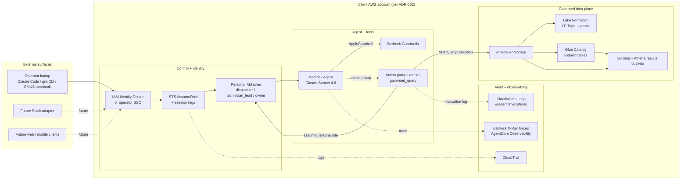

Everything inside the **CLIENT** boundary is provisioned by Terraform
in this repo. Nothing external is required to run the system — no
SaaS dependencies, no shared backend, no observability vendor.

---

## 2. Core architectural choices

These are non-negotiable. ADR references are in
`consulting/guardrailed-agent/decisions/` in the ms3dm.tech vault.

| Layer | Choice | Source |
|---|---|---|
| Agent runtime | Amazon Bedrock Agents | [ADR-001](../ms3dm.tech/consulting/guardrailed-agent/decisions/001-bedrock-agents-and-guardrails.md) |
| Guardrails | Amazon Bedrock Guardrails | [ADR-001](../ms3dm.tech/consulting/guardrailed-agent/decisions/001-bedrock-agents-and-guardrails.md) |
| Model | Anthropic Claude on Bedrock (Sonnet 4.6 default; Opus selectable) | [ADR-001](../ms3dm.tech/consulting/guardrailed-agent/decisions/001-bedrock-agents-and-guardrails.md) |
| Tools | AWS Lambda action groups (OpenAPI 3 schemas) | [ADR-001](../ms3dm.tech/consulting/guardrailed-agent/decisions/001-bedrock-agents-and-guardrails.md) |
| Data plane | S3 + Apache Iceberg + AWS Glue Catalog + AWS Lake Formation | [ADR-003](../ms3dm.tech/consulting/guardrailed-agent/decisions/003-data-plane-and-identity.md) |
| Identity propagation | ABAC session tags (`aws:PrincipalTag/role`, `aws:PrincipalTag/service_region`) | [ADR-003](../ms3dm.tech/consulting/guardrailed-agent/decisions/003-data-plane-and-identity.md) |
| Observability | Bedrock-native X-Ray traces + AgentCore Observability via CloudWatch Logs | [ADR-004](../ms3dm.tech/consulting/guardrailed-agent/decisions/004-observability.md) |
| Front-end | Headless backend; multiple thin clients | — |
| IaC | Terraform (HCL); module-per-concern | brief §6 |
| Deployment topology | One AWS account per environment/client | [ADR-002](../ms3dm.tech/consulting/guardrailed-agent/decisions/002-deployment-topology.md) |
| Schema | HVAC home-services (12 tables, dual LF-tag scheme) | [ADR-008](../ms3dm.tech/consulting/guardrailed-agent/decisions/008-dataset-pivot-hvac-home-services.md) |
| MCP server | Reference implementation, two deployment shapes | [ADR-009](../ms3dm.tech/consulting/guardrailed-agent/decisions/009-mcp-as-reference-implementation.md) |

Deprecated path (do not revisit):

- [ADR-000 — Retire NeMo Guardrails / EC2](../ms3dm.tech/consulting/guardrailed-agent/decisions/000-retire-nemo-guardrails-ec2.md)

The thread tying these together: every choice was made so that the
client's security and legal teams encounter only AWS-shaped questions
they already know how to answer. Self-hosted alternatives (NeMo, EC2)
were rejected explicitly in ADR-000.

---

## 3. Logical components

The system is six logical components, each implemented in a single
Terraform module or Python package. Boundaries are real — modules
expose typed inputs and outputs; nothing reaches across.

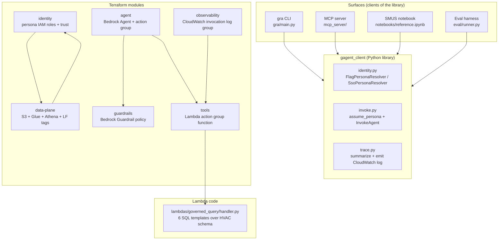

| Component | Role | Lives in |
|---|---|---|
| `gagent_client` | Persona resolution, AssumeRole, InvokeAgent, trace summarization, structured-log emission | `gagent_client/` |
| `mcp_server` | Stdio MCP transport over `gagent_client`; nine tools; two deployment shapes | `mcp_server/` |
| `gra` CLI | Pipeable shell over `gagent_client`; `ask` / `personas` / `traces` | `gra/` |
| `governed_query` Lambda | Six parameterized SQL templates against the HVAC schema; assumes persona role per invocation | `lambdas/governed_query/` |
| Terraform modules | Six modules wiring the AWS surface area | `terraform/modules/*/` |
| Env composition | One env directory per deployment; only `terraform.tfvars` differs across envs | `terraform/envs/<env>/` |

---

## 4. Deployment topology

Per [ADR-002](../ms3dm.tech/consulting/guardrailed-agent/decisions/002-deployment-topology.md),
the architecture is **per-client AWS account**. There is no shared
multi-tenant SaaS backend — that decision is a load-bearing piece of
the security narrative.

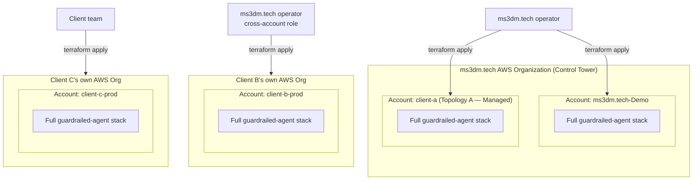

The same Terraform module under `terraform/modules/` drives every
deployment. The `terraform/envs/` directory composes modules with
client-specific variables — nothing inside `terraform/modules/` is
account-aware.

| Mode | Where `terraform apply` runs | Account context |
|---|---|---|
| **A. Managed** | ms3dm.tech operator | Account inside the ms3dm.tech AWS Org named `client-<name>` |
| **B. Delivery** | ms3dm.tech operator via cross-account role | Client's own AWS account |
| **C. DIY** | Client's team | Client's own AWS account |

Anything Org / Control Tower–related lives outside the deployable
module so client deployments don't drag in AWS-Org assumptions the
client doesn't have.

---

## 5. Identity and the ABAC propagation chain

The single most important diagram in this architecture: how a caller's
identity becomes the principal that Lake Formation evaluates against.
Every persona's permission shape comes from the **session tags** on
their assumed role, never from a hardcoded role ARN in policy.

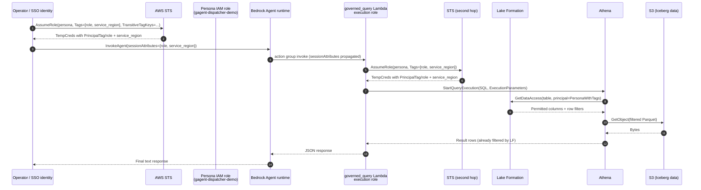

The four design properties this chain delivers:

1. **No hardcoded role ARN in policy.** LF tag-policy grants reference
   `aws:PrincipalTag/role` (and for technician_lead, `service_region`).
   Adding a new persona means adding a new role with the right tag
   trust condition; the data-plane policy never changes.
2. **The Lambda is not a security boundary.** The Lambda's execution
   role can `sts:AssumeRole` on the persona roles, but the *persona*
   tags it injects on each AssumeRole are what LF evaluates. A bug in
   the Lambda cannot grant itself extra access.
3. **Transitive tags survive role chaining.** `TransitiveTagKeys`
   ensures `role` and `service_region` propagate through the second
   AssumeRole hop, so LF sees the same principal tags whether the
   query was started by the operator directly or by the Lambda on
   their behalf.
4. **Trust policies enforce the tag.** Each persona role's trust
   policy requires `aws:RequestTag/role=<persona>` to permit the
   AssumeRole. Even an operator with admin permissions cannot assume
   `gagent-owner-demo` without supplying `role=owner`.

### Persona-to-role mapping

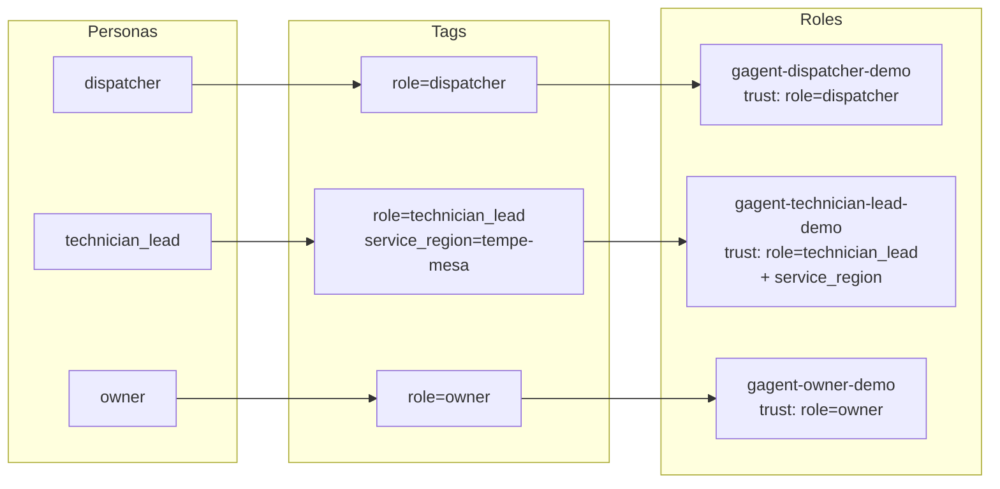

The `service_region` tag is mandatory only for `technician_lead`. The
trust policy on that role requires it; the trust policies on the
other two roles forbid it (via `ForAllValues:StringEquals` on
`aws:TagKeys`).

---

## 6. Lake Formation governance model

Per [ADR-008](../ms3dm.tech/consulting/guardrailed-agent/decisions/008-dataset-pivot-hvac-home-services.md),
the dataset uses a **dual-tag scheme**: `pii` and `sensitivity`.
Together they answer two orthogonal questions: "who can see customer
identities?" and "who can see margin / cost data?"

```mermaid
flowchart TB
    subgraph TAGS["LF-Tag definitions"]
        TP[pii: true / false]
        TS[sensitivity: high / other]
    end

    subgraph DEFAULTS["Database defaults"]
        DB[guardrailed_agent_demo<br/>pii=false, sensitivity=other]
    end

    subgraph COLS["Per-column tag attachments"]
        C1[customer.first_name<br/>pii=true]
        C2[customer.email<br/>pii=true]
        C3[parts_inventory.unit_cost_usd<br/>sensitivity=high]
        C4[customer.customer_id<br/>pii=false, sensitivity=other]
    end

    subgraph GRANTS["LF-Tag grants per persona"]
        G1[dispatcher: pii=false AND sensitivity=other]
        G2[technician_lead: pii in {true, false} AND sensitivity=other]
        G3[owner: pii in {true, false} AND sensitivity in {high, other}]
    end

    subgraph PRIN["IAM principals"]
        I1[gagent-dispatcher-demo]
        I2[gagent-technician-lead-demo]
        I3[gagent-owner-demo]
    end

    TP --> DEFAULTS
    TS --> DEFAULTS
    DEFAULTS --> COLS
    COLS --> GRANTS
    G1 --> I1
    G2 --> I2
    G3 --> I3
```

### Visibility matrix (the truth table)

| Column class | Tag attachment | Dispatcher | TechnicianLead | Owner |
|---|---|---|---|---|
| Identity / PII | `pii=true, sensitivity=other` | redacted | visible | visible |
| Margin / cost | `pii=false, sensitivity=high` | redacted | redacted | visible |
| Identity *and* margin | `pii=true, sensitivity=high` | redacted | redacted | visible |
| Domain (everything else) | `pii=false, sensitivity=other` (database default) | visible | visible | visible |

Two design notes:

- **Dispatcher's grant is the strictest tag expression**, not a
  blanket deny. LF will hide *any* column whose tags don't match
  exactly `pii=false AND sensitivity=other`. New PII or new
  sensitivity-tagged columns are dispatcher-hidden by default.
- **TechnicianLead's row filter is a Phase 2 feature.** Currently
  TechnicianLead sees PII for all regions; the Phase 2 LF row filter
  will restrict rows to the assigned `service_region` session tag.
  The plumbing is in place — `service_region` rides the AssumeRole
  chain end-to-end — but the LF row filter resource is not yet bound.
  See `mcp_server/governance.py` `row_filters: []` placeholder.

### Static probe (`explain_governance`)

The MCP `explain_governance` tool reproduces this evaluation
client-side without running a query:

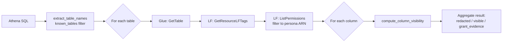

This is what makes "why didn't I see column X?" answerable without a
data engineer.

---

## 7. Bedrock Guardrails

A single guardrail policy is provisioned and attached to the Bedrock
Agent. It runs on **both directions** — input prompts and output
responses.

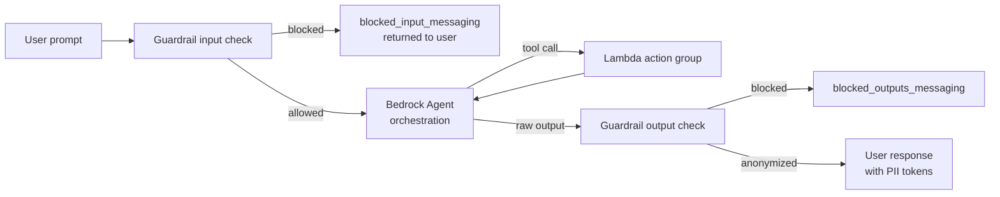

### Configured policies

| Policy | Setting |
|---|---|
| **PII filters** (EMAIL, PHONE, US_SOCIAL_SECURITY_NUMBER, ADDRESS, NAME) | `ANONYMIZE` (configurable; default keeps the conversation alive) |
| **Content — Prompt Attack** | input HIGH, output NONE |
| **Content — Sexual / Hate / Violence / Insults / Misconduct** | HIGH both directions |
| **Denied topics** | Custom per-deployment list (legal advice, medical advice, off-domain) |
| **Contextual grounding** | GROUNDING + RELEVANCE filters with thresholds |

### Defense-in-depth interaction with Lake Formation

The two governance layers are **independent and complementary**:

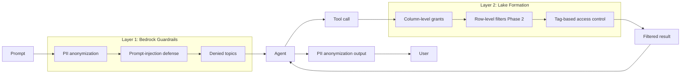

If Lake Formation fails open (it doesn't), Guardrails would still
anonymize PII before output. If Guardrails fails open, LF would still
have hidden the underlying columns at query time. The model literally
never sees PII when a dispatcher asks — that's the strong property.

---

## 8. Surfaces and the headless backend

The agent backend is **headless** — `bedrock-agent-runtime:InvokeAgent`
is the API. Surfaces are thin shims on top of `gagent_client`, never
on top of each other.

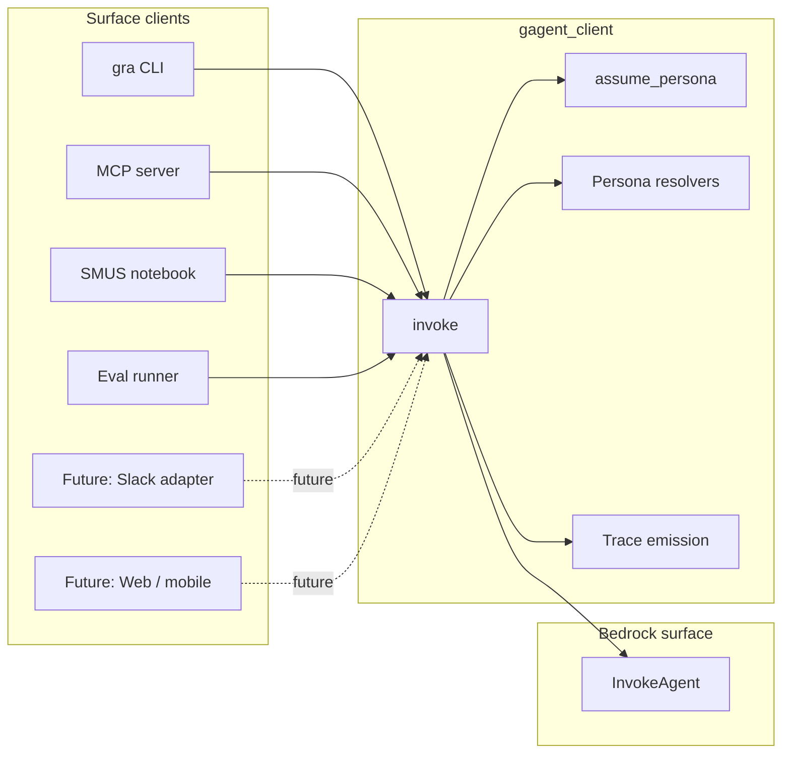

This is a load-bearing constraint. If the CLI grew session state,
auth context, or domain logic, every future surface would either
inherit those choices or fork. Keeping all of that in `gagent_client`
means a new surface (Slack adapter, Cognito-fronted web app) is a
shim, not a refactor.

---

## 9. The MCP server in this architecture

The MCP server is a **transport + interface layer**. It exposes nine
tools to MCP clients (Claude Code, Claude Desktop) over the standard
Model Context Protocol. It enforces **nothing security-critical** —
Lake Formation and Bedrock Guardrails do that work upstream and
downstream.

For the protocol theory, see [`docs/mcp/whitepaper.md`](docs/mcp/whitepaper.md).
This section describes the server's place in the architecture.

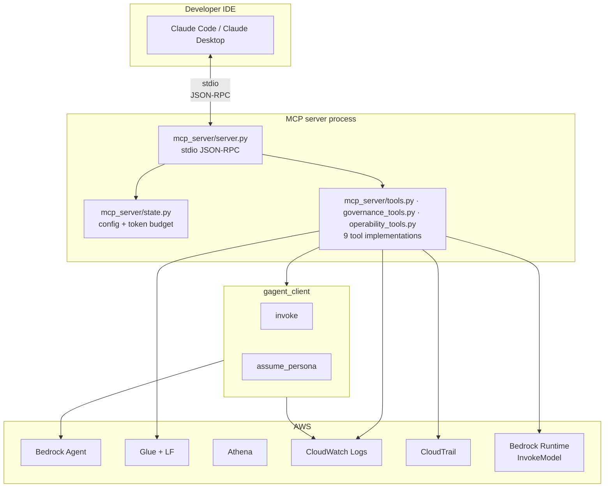

### The nine tools

| Phase | Tool | What it does | AWS surface used |
|---|---|---|---|
| 2.a | `ask_agent` | Run one full agent turn under the persona | InvokeAgent |
| 2.a | `describe_schema` | List tables / describe one — LF filters columns | Glue |
| 2.a | `list_tools` | Self-describing inventory + active persona | (none) |
| 2.b | `explain_governance` | Predict what LF would redact, without running | Glue + LF |
| 2.b | `eval_query` | Pre-flight cost + grant report | Glue + LF + S3 |
| 2.b | `audit_trace` | Correlate session_id → CloudWatch + CloudTrail | CW Logs Insights + CloudTrail |
| 2.c | `propose_query` | Draft SQL via Bedrock Runtime, do not execute | Bedrock Runtime |
| 2.c | `recent_traces` | Recent invocations from invocation log group | CW Logs Insights |
| 2.c | `health` | Reachability snapshot across the stack | Bedrock + Athena + Glue + LF + Logs |

### Two deployment shapes

```mermaid
flowchart TB
    subgraph A["Shape A — Single-operator (Personal demo)"]
        AA[Operator] --> AB[GAGENT_TRUSTED_OPERATOR=1<br/>trust gate]
        AB --> AC[FlagPersonaResolver]
        AC --> AD[--persona flag honored]
    end

    subgraph B["Shape B — Team adoption (IAM Identity Center)"]
        BA[Developer] --> BB[aws sso login]
        BB --> BC[STS GetCallerIdentity]
        BC --> BD[Parse AWSReservedSSO ARN]
        BD --> BE[persona_mapping.json]
        BE --> BF[SsoPersonaResolver]
        BF --> BG[--persona flag IGNORED<br/>WARN logged]
    end
```

The flag on/off behavior is the safety property: in Shape B a
developer in a Dispatcher permission set cannot escalate by passing
`--persona owner`. The persona is bound to the IIC identity, not to
the caller's request.

---

## 10. End-to-end request flow

This is the canonical path for a single question, end-to-end, across
every surface. Read this with §5 (ABAC chain) and §6 (LF) open.

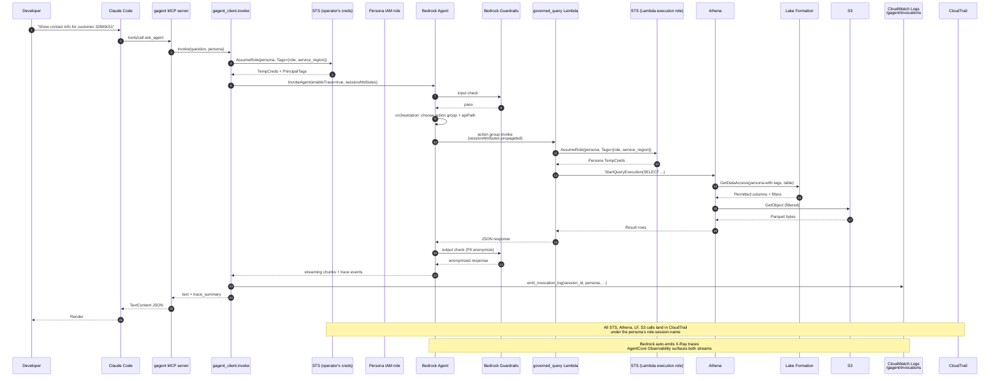

The two trace streams (Bedrock-native X-Ray + the gagent invocation
log) converge in the CloudWatch console under "GenAI Observability,"
and CloudTrail captures every assumed-role API call separately.
`audit_trace(session_id)` is the one-shot bridge between them.

---

## 11. Observability and audit

Three independent streams, all AWS-native, all queryable by a
client's existing security tooling.

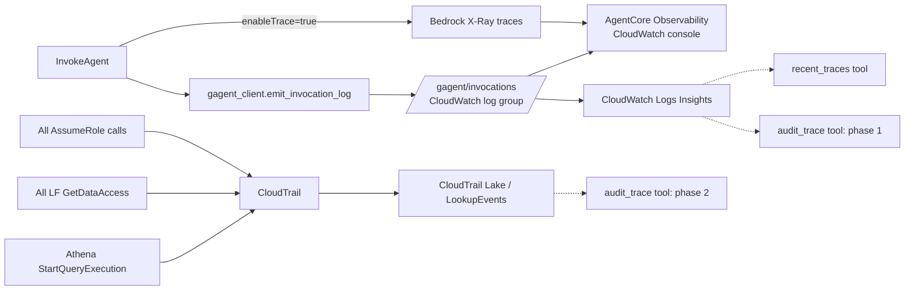

### What is in each stream

| Stream | Contents | Retention | Query path |
|---|---|---|---|
| Bedrock X-Ray traces | Model token usage, tool call latency, guardrail decisions | Per AWS X-Ray defaults | CloudWatch GenAI Observability console |
| `/gagent/invocations` log group | Per-invocation JSON: session_id, persona, role_session_name, surface, tools_called, guardrail_blocks, prompt+response, duration | Configurable (`invocation_log_retention_days`) | CloudWatch Logs Insights |
| CloudTrail | Every STS / LF / Athena / S3 / Bedrock API call | Per CloudTrail config (default 90d) | LookupEvents API; CloudTrail Lake |

### Correlation key: `role_session_name`

The single most useful identifier for cross-stream correlation:

- `gagent_client.invoke()` generates a `RoleSessionName` of the form
  `gagent-<persona>-<6 hex chars>` for each call.
- That name lands in the CloudWatch invocation log entry.
- CloudTrail records every API call made under those credentials with
  `Username = <role_session_name>`.
- `audit_trace(session_id)` reads the role_session_name from the
  invocation log and uses it as a `Username` filter on
  `cloudtrail:LookupEvents`.

That's the closed loop between "the agent answered" and "here is
exactly what AWS APIs were called as a result."

---

## 12. Module boundaries and IaC composition

Every Terraform module is **account-agnostic** and composable from
any `terraform/envs/<env>/` with only variables.

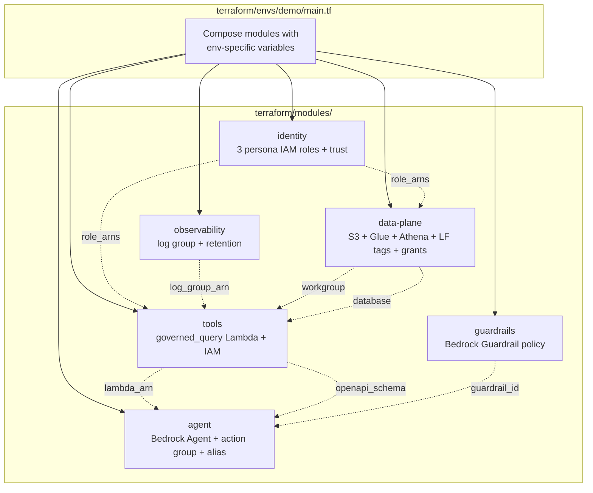

### Inputs / outputs per module

| Module | Key inputs | Key outputs |
|---|---|---|
| `observability` | `env`, `log_group_name`, `log_retention_days` | `invocation_log_group`, `invocation_log_group_arn` |
| `identity` | `env`, `trusted_assumer_arns`, `data_bucket_arns`, `glue_database_name`, `athena_workgroup_name` | `dispatcher_role_arn`, `technician_lead_role_arn`, `owner_role_arn`, `all_persona_role_arns` |
| `data-plane` | `env`, `glue_database_name`, `s3_bucket_prefix`, persona role ARNs | `glue_database_name`, `athena_workgroup_name`, LF tag keys/values |
| `guardrails` | `env`, denied topics, thresholds | `guardrail_id`, `guardrail_version` |
| `tools` | `lambda_source_dir`, `athena_workgroup_name`, `glue_database_name`, persona role ARNs, log group | `lambda_arn`, `openapi_schema_inline` |
| `agent` | `foundation_model_id`, `guardrail_id`, `action_group_lambda_arn`, OpenAPI schema | `agent_id`, `agent_alias_id`, `agent_alias_arn` |

The composition pattern is: env layer reads variables, calls modules,
threads outputs of one module into inputs of another. **Modules never
read each other's state with `terraform_remote_state`.** That keeps
each module independently testable and re-composable for a new env.

---

## 13. Trust boundaries

Five trust boundaries, each one a place where authority is checked
and pivoted.

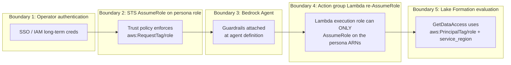

### What each boundary protects against

| # | Boundary | Threat it stops |
|---|---|---|
| 1 | Operator auth | Unauthenticated callers reach the system at all. AWS auth required. |
| 2 | STS persona AssumeRole | Operator with admin can't assume `owner` without explicitly tagging `role=owner`. The trust policy refuses. |
| 3 | Bedrock Agent + Guardrails | Prompt injection that tries to override system prompt; PII fabricated by the model; off-topic abuse. |
| 4 | Lambda re-AssumeRole | A bug in the Lambda handler can't expand its access — the execution role is restricted to AssumeRole on persona ARNs only. |
| 5 | Lake Formation | The whole point. LF is the authoritative gate; everything above is defense in depth. Even a Lambda compromise can't read PII as `dispatcher`. |

The MCP server is **not** a trust boundary. It runs on the operator's
laptop with the operator's credentials. A compromised MCP server
process is no worse than a compromised operator shell.

---

## 14. Failure and degradation modes

Each component has a defined failure mode that is observable and
non-cascading.

```mermaid
flowchart TB
    F1[CloudWatch Logs emission fails] -->|swallowed| C1[Agent path continues<br/>trace_summary.log_stream=None]
    F2[Bedrock Runtime throttle] -->|propagates| C2[InvokeAgent returns ThrottlingException<br/>caller decides retry]
    F3[Lake Formation denies] -->|expected| C3[Lambda returns 403<br/>agent reports 'Access denied']
    F4[Athena query fails] -->|expected| C4[Lambda returns 500<br/>upstream AWS error logged]
    F5[Guardrail intervenes] -->|by design| C5[blocked_input/output_messaging<br/>returned to user]
    F6[MCP server crashes] -->|stdio EOF| C6[Claude Code marks server unavailable<br/>operator restarts]
    F7[Persona role ARN unset] -->|startup error| C7[Tools return structured error<br/>not crash]
    F8[Logs Insights timeout 5s] -->|degraded| C8[health() reports degraded<br/>recent_traces still works]
```

The two design rules:

1. **Observability never blocks the agent path.** CloudWatch Logs
   failures are caught and logged but never raise to the caller. The
   agent answer ships even if the trace doesn't.
2. **Configuration gaps return structured errors, not crashes.** The
   MCP server starts even if persona role ARNs aren't configured —
   each tool that needs them returns a `{"error": "..."}` payload
   describing what's missing. Tests can run against a partially
   configured environment.

---

## 15. Non-MVP constraints already accommodated

These ship later but cannot be retrofitted cheaply. Phase 1 designs
keep them in scope; raise it before any change that would break them.

| Requirement | Phase 1 design rule | How the architecture honors it |
|---|---|---|
| **Slack channel adapter** | Headless backend; CLI is one client | `gagent_client` is the consumed library; surfaces are shims |
| **MCP server tool channel** | Lambda business logic free of Bedrock-specific glue | The `governed_query` Lambda parses Bedrock event shape only at the boundary; the SQL templates know nothing about Bedrock |
| **Mobile-private access** | Same headless principle | All surfaces share `InvokeAgent`; no surface-specific session state |
| **Per-client deployments via Topology C** | Account-agnostic Terraform module | No hardcoded ARNs / account IDs / region-specific resources inside `terraform/modules/` |
| **Terraform module reusability** | Modules usable from any env with only variables | `terraform/envs/<new>/` is a composition point, not a fork |
| **LF row-level filter** | Phase 2 row filter resource | `service_region` already rides the AssumeRole chain end-to-end; the LF row filter resource is the only addition |

If a Phase 1 design choice would make any of the above hard to add
later, that's a constraint violation worth flagging.

---

## 16. Where to read more

| For… | Read |
|---|---|
| MCP protocol theory and how the MCP server applies it | [`docs/mcp/whitepaper.md`](docs/mcp/whitepaper.md) |
| The full Phase 1 brief | [`docs/repo-bootstrap-brief.md`](docs/repo-bootstrap-brief.md) |
| Cold-start operator runbook | [`docs/operator-runbook.md`](docs/operator-runbook.md) |
| Demo talk track | [`docs/demo-script.md`](docs/demo-script.md) |
| MCP governance tools (live JSON samples) | [`docs/mcp/governance-tools.md`](docs/mcp/governance-tools.md) |
| Team-adoption (Shape B) walkthrough | [`docs/mcp/team-deployment.md`](docs/mcp/team-deployment.md) |
| ADRs (architecture decisions) | `consulting/guardrailed-agent/decisions/*.md` in the ms3dm.tech vault |
| Cross-engagement practice doc | `consulting/practice/deployment-topology.md` in the ms3dm.tech vault |
